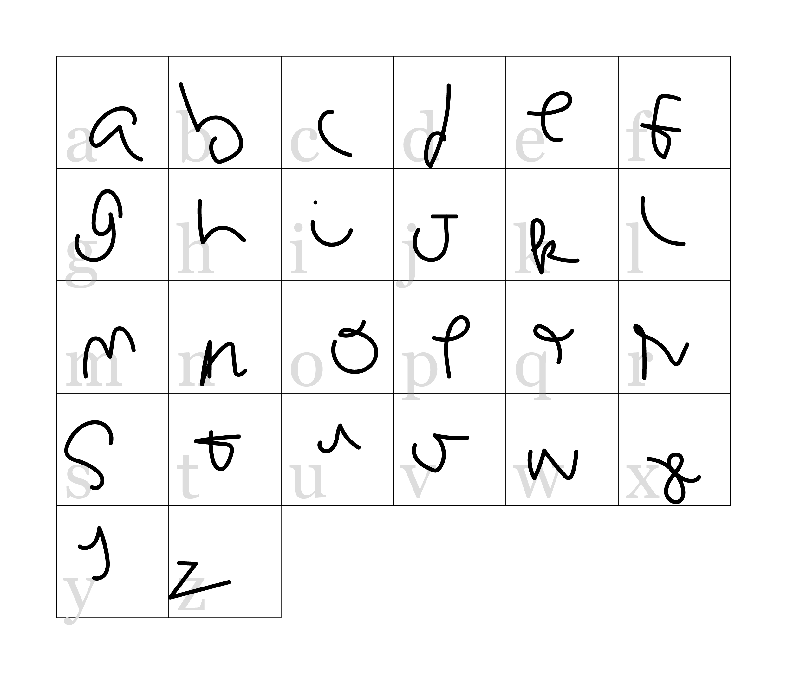
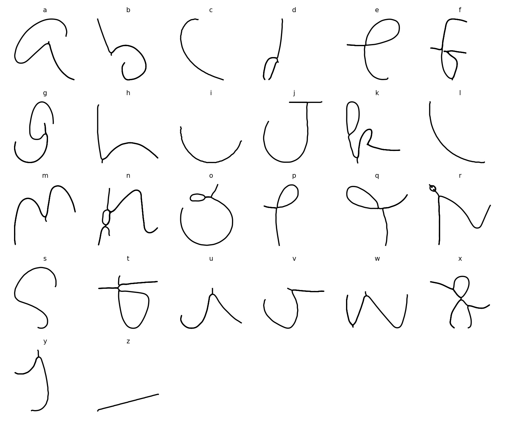

# vectorcurve

Turn a page of your handwriting into an installable font — plus, as a
byproduct, a tool for morphing one person's handwriting into another's.



This builds directly from my earlier research project,
[AM111_Final](https://github.com/tuechile/AM111_Final), which compared
several ways to fit a compact K-control-point curve to a handwriting
stroke's arc-length parameterization: classical splines, Bezier, and a
learned neural basis (an MLP mixing `sin` and `tanh` activations,
hypothesized to represent self-intersecting loops more robustly than a
fixed basis). Benchmarked head-to-head on a self-intersecting stroke,
that hypothesis didn't hold up: the cubic B-spline fit was 1-3 orders of
magnitude more accurate at every K tested, and it was the neural basis
that drew a "shortcut" straight across the self-intersection — exactly
the artifact it was meant to avoid. So the pipeline fits a B-spline
(`pipeline/curve_model.py`'s `BSplineCurve`/`train_bspline`); the neural
basis (`NeuralBasisCurve`/`train_neural_basis`) is kept in the same file
for comparison.

Generic raster-to-vector tools (potrace, Adobe Image Trace, Vector Magic) already turn scanned handwriting into vector curves. They're not the
point here. What they don't do well is handle **cursive self-intersections**
gracefully — a plain polyline trace or a spline fit to a noisy skeleton
tends to draw a straight "shortcut" segment across a loop instead of
following it, which matters a lot for letterforms like cursive `e`, `o`, `l`.
The B-spline curve traces those crossings correctly (see above);
`pipeline/curve_model.py`'s docstring has the benchmark numbers.

## Pipeline

```
scan/photo of handwriting
        │  (skimage: Otsu threshold -> skeletonize -> Eulerian trail -> arc-length param)
        ▼
   ordered (s, x, y) curve per glyph
        │  (pipeline/curve_model.py: K-control-point cubic B-spline, trained per glyph)
        ▼
   compact BSplineCurve per glyph
        │
        ├─(pipeline/font_export.py)──▶ closed glyph outline (Shapely stroke buffer) ──▶ .ttf
        │
        └─(pipeline/morph.py, byproduct)──▶ control-point-interpolated in-between curves ──▶ .gif
```

## Use

```bash
pip install -r requirements.txt

# 1. Generate a printable capture sheet (one box per letter)
python scripts/01_generate_template.py --out template.svg

# 2. Print at 100% scale, write one letter per box, scan at (e.g.) 300 DPI
python scripts/02_segment_scan.py --scan scan.png --template-meta template.json \
    --dpi 300 --out-dir data/glyphs

# 3. Train a compact B-spline curve for each glyph
python scripts/03_train_glyphs.py --glyphs-dir data/glyphs --out-dir models --k 60 --epochs 2000

# 4. Export an installable font
python scripts/04_export_font.py --models-dir models --out fonts/MyHandwriting.ttf \
    --family-name "My Handwriting"

# 5. (Byproduct) morph two trained samples of the same letter into each other
python scripts/05_make_morph.py --model-a models/a.pt --model-b models/a_friend.pt \
    --out outputs/morph_a.gif
```